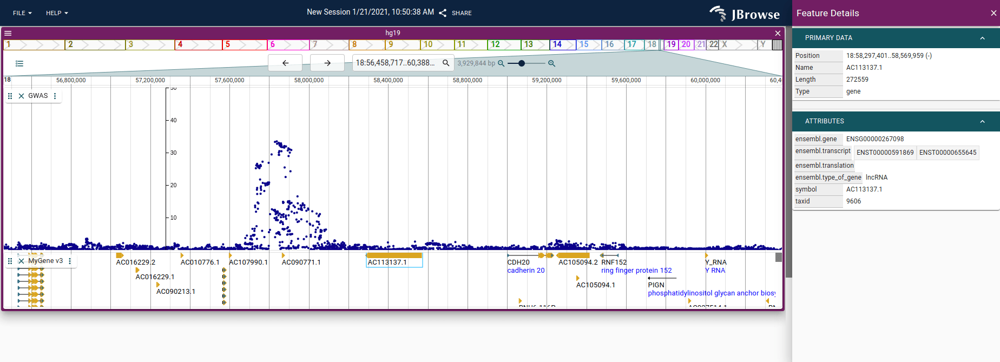
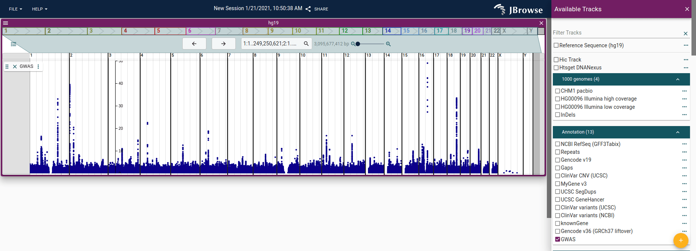

# jbrowse-plugin-gwas

Plugin for displaying GWAS results such as manhattan plot renderings

## Screenshot

 

## Data format

jbrowse-plugin-gwas will render any features with a "score". A common format is
a BED-like file, perhaps with tabix added. Example with plain BED, where the
score is in column 5

```
chr22 1000 5000 rs123 84.141
chr22 2000 6000 rs456 40.12312
```

Sometimes, the file format is not a strict BED but something with just one
coordinate instead of a start and end. Example with BED-like data (only one
coordinate column)

```
#chrom  pos     rsid    ref     alt     neg_log_pvalue  beta    stderr_beta     alt_allele_freq
1       721290  rs12565286      G       C       0.275233        .       .       .
1       752566  rs3094315       G       A       0.0315638       .       .       .
1       775659  rs2905035       A       G       0.183626        .       .       .
1       777122  rs2980319       A       T       0.207258        .       .       .
1       779322  rs4040617       A       G       0.0326393       .       .       .
1       780785  rs2977612       T       A       0.0225965       .       .       .
```

This file format can be indexed using tabix with something BED-like

```
tabix -0 -b 2 -s 1 -e 2 -f out.bed.gz
```

The beginning (-b) and end (-e) coordinates of the features are set to the same
column (2), and the sequence column (-s) is 1. Also assumes zero-based
coordinates (-0)

Note that this is just one format that can be used for the plugin, any adapter
can be used that provides features with a score attribute, and it assumes the
score is already -log10(p) transformed (this means if your file has raw
p-values, you may need to modify them or add a -log10(p) to the file)

## Example config

The below config uses the "scoreColumn" attribute to set neg_log_pvalue (as seen
in above section) to be the score that is plotted

```json
{
  "type": "GWASTrack",
  "trackId": "gwas_track",
  "name": "GWAS",
  "category": ["Annotation"],
  "assemblyNames": ["hg19"],
  "adapter": {
    "type": "BedTabixAdapter",
    "scoreColumn": "neg_log_pvalue",
    "bedGzLocation": {
      "uri": "https://s3.amazonaws.com/jbrowse.org/genomes/hg19/gwas/summary_stats.txt.gz"
    },
    "index": {
      "location": {
        "uri": "https://s3.amazonaws.com/jbrowse.org/genomes/hg19/gwas/summary_stats.txt.gz.tbi"
      },
      "indexType": "TBI"
    }
  },
  "displays": [
    {
      "displayId": "gwas_display",
      "type": "LinearManhattanDisplay"
    }
  ]
}
```

## Usage in jbrowse-web

Add to the "plugins" of your JBrowse Web config. The unpkg CDN should be stable,
or you can download the js file to your server

```json
{
  "plugins": [
    {
      "name": "GWAS",
      "url": "https://unpkg.com/jbrowse-plugin-gwas/dist/jbrowse-plugin-gwas.umd.production.min.js"
    }
  ]
}
```

This plugin is currently quite basic, and there is no mouseover interactivity or
drawn labels on features

#### Demo

https://jbrowse.org/code/jb2/main/index.html?config=https%3A%2F%2Funpkg.com%2Fjbrowse-plugin-gwas%2Fdist%2Fconfig.json&session=share-3SQ5lsql41&password=VAmX9

### For use in jbrowse/react-linear-genome-view

See [DEVELOPMENT](DEVELOPMENT.md)
